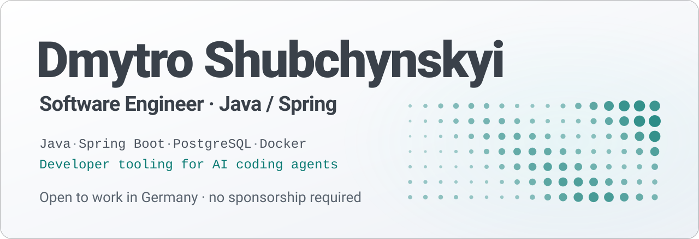

<a href="https://www.linkedin.com/in/shubchynskyi">
  <picture>
    <source media="(prefers-color-scheme: dark)" srcset="assets/banner-dark.svg">
    
  </picture>
</a>

  <a href="https://www.linkedin.com/in/shubchynskyi"><b>LinkedIn</b></a>
  &middot;
  <a href="https://shubchynskyi.pp.ua"><b>Portfolio</b></a>
  &middot;
  <a href="https://github.com/Garda-Studio"><b>Garda Studio</b></a>

## About

Java backend developer working with Spring Boot, REST APIs, PostgreSQL and Spring Security. I maintain and extend Spring applications, fix defects and cover changes with automated tests.

I use AI coding agents with code review and test validation, and I build open-source tooling for controlled AI coding-agent workflows.

Authorized to work in Germany. No employer sponsorship required.

## Projects

| Project | What it is | Stack |
| --- | --- | --- |
| [Authentication & User Management Service](https://github.com/Shubchynskyi/Authentication-service) | JWT authentication, Google OAuth2 and role-based access control | Java, Spring Boot, Spring Security, PostgreSQL, Testcontainers |
| [Garda Agent Orchestrator](https://github.com/Garda-Studio/garda-agent-orchestrator) | Open-source CLI for controlled AI coding-agent workflows: task lifecycle, mandatory quality gates, reviews and an auditable task history | Node.js, TypeScript |

## Stack

- **Backend:** Java, Spring Boot, Spring Security, REST APIs, Spring Data JPA, Hibernate
- **Databases:** PostgreSQL, MySQL, Liquibase
- **Testing:** JUnit, Mockito, Testcontainers, Selenium
- **Tools:** Docker, Maven, Git, Jenkins, Linux
- **AI-assisted development:** coding agents, task and context preparation, review of generated changes, test validation
